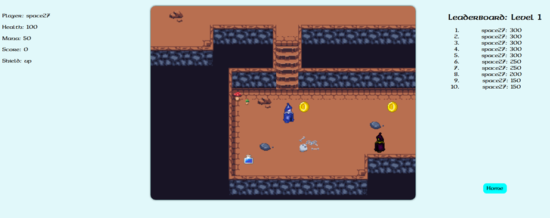
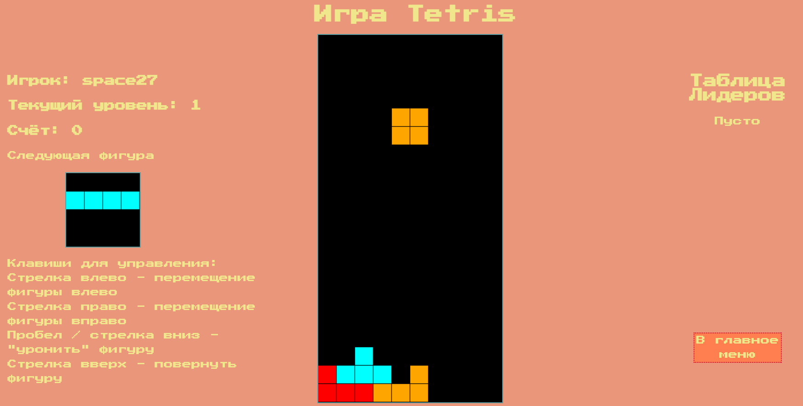
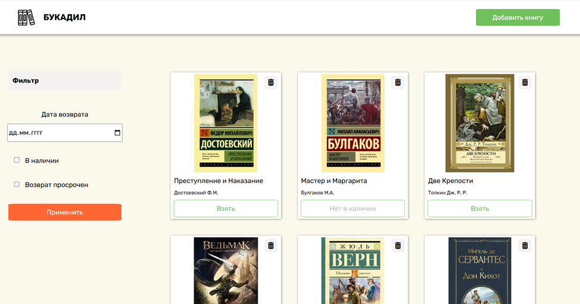
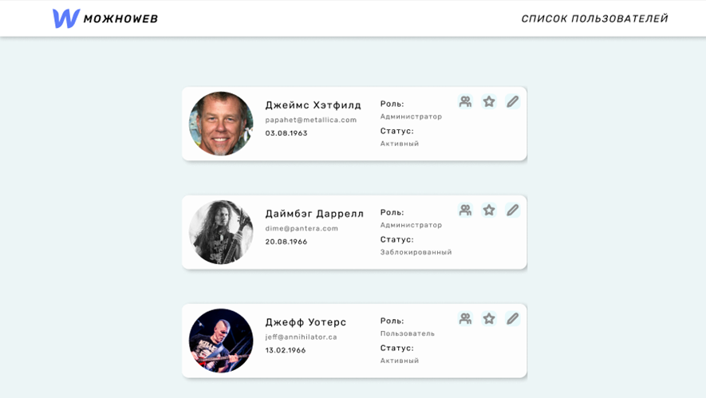
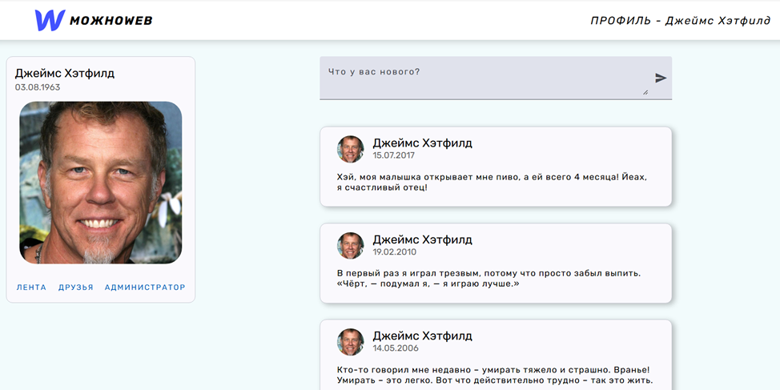
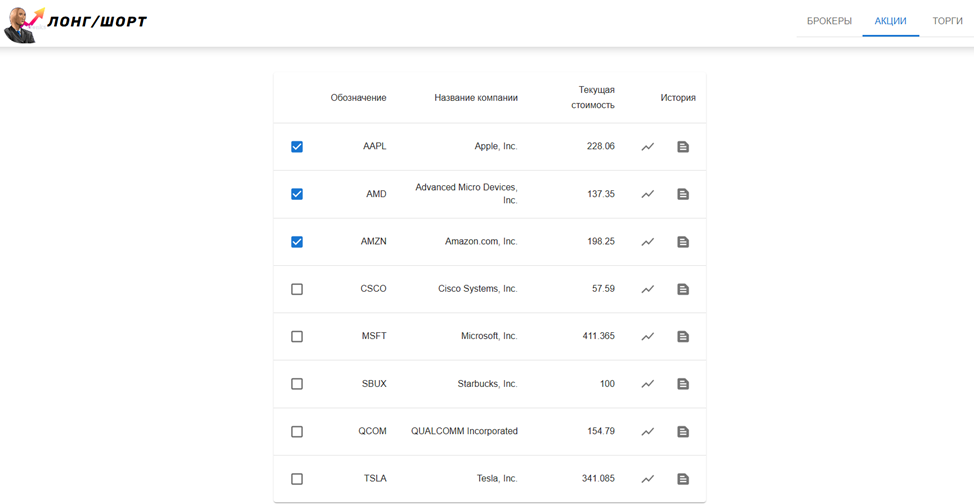
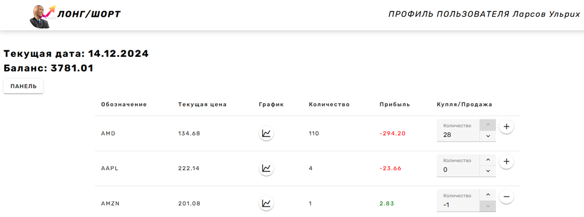

# frontend-Node.js-experience

## Лабораторные работы по курсу Web-технологии

### [CourseWork](cw(js-game))

#### Двумерная 2D пиксельная игра с видом сверху

Есть интеллектуальные противники, которые идут и стреляют в игрока при приближении.  
Бонусы:

* здоровье +50
* мана +50
* счет +50.

Способности:

* Пробел/ЛКМ - выстрел (25 маны)
* E - щит (50 маны)
* Q - самонаводящийся снаряд (100 маны)

#### Стек

* HTML
* CSS
* JavaScript

### [Lab1](lab1(js-tetris))

#### Игра "Тетрис" на чистом JavaScript

Есть страница ввода имени пользователя, ускорение с набором очков, звуки.

#### Стек

* HTML
* CSS
* JavaScript

### [Lab2](lab2(express-js-library))

#### Web-приложение "Домашняя библиотека"

Есть возможность просмотреть список книг, удалить книгу, добавить книгу.  
Можно открыть карточку книги, где можно взять книгу, вернуть и отредактировать.  
Все изменения сохраняются на сервере.

#### Стек

* Express.js
* Pug
* AJAX

### [Lab3](lab34(express-bootstrap-social-network))

#### Администраторский модуль приложения "Социальная сеть"

Является сервером непосредственно как клиентской частью администраторского модуля, так и серверной частью
пользовательского модуля.  
Есть список пользователей. Можно отредактировать пользователя, посмотреть его друзей и новости его друзей.

#### Стек

* Express.js
* Pug
* LESS
* Bootstrap
* JQuery
* GULP
* Webpack

### [Lab4](lab4(angular-social-network))

#### Пользовательский модуль приложения "Социальная сеть"

Есть возможность входа в профиль и регистрации. В профиле видны новости пользователя, есть возможность добавить новую
новость.  
Можно изменить фотографию профиля, управлять друзьями (удалить/добавить), посмотреть новости друзей, а также войти в
администраторский модуль при наличии прав.

#### Стек

* TypeScript
* Angular
* Angular Material
* Socket IO
* Jest

### [Lab56](lab56(nest-js-stocks))

#### Серверная часть приложения "Биржа акций"

Реализованы модули для брокеров, акций и торгов. Информация хранится в виде JSON. Используются сокеты после обновления
информации.

#### Стек

* TypeScript
* NestJS
* Socket IO

### [Lab5](lab5(react-stocks))

#### Администраторский модуль приложения "Биржа акций"

Есть возможность посмотреть список брокеров, отредактировать их, добавить/удалить.  
Можно посмотреть список акций, выбрать текущие торгуемые акции, посмотреть историческую сводку о цене акций в табличном
и графическом виде.  
Есть возможность запустить торги для имитации торгов на бирже.

#### Стек

* TypeScript
* React
* Material UI
* Socket IO
* Chart.js

### [Lab6](lab6(vue-stocks))

#### Пользовательский модуль приложения "Биржа акций"

Есть возможность авторизации брокера и входа в профиль брокера, где есть сводка о каждой купленной акции: текущая цена,
количество и прибыль.  
Также можно купить/продать акции по текущей цене.  
Есть панель администратора, в которой видна краткая сводка о каждом брокере: список акций и прибыль по ним.

#### Стек

* Vue.js
* Vuetify
* Selenium
* Socket IO
* Chart.js